# locifilemanager-v2

File manager for the LOCI mass storage device on Oric Atmos — v2 rebuild using Oscar64.

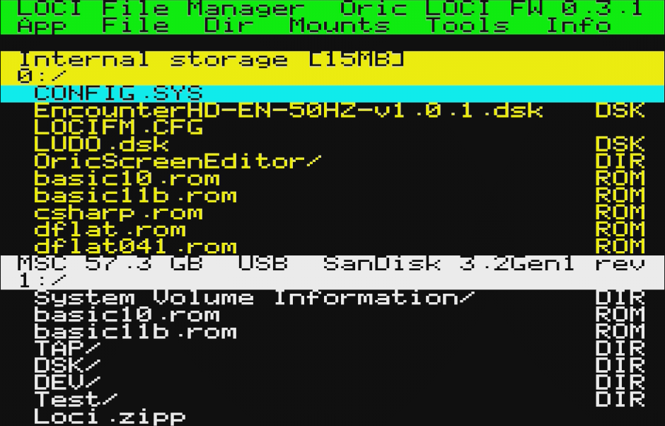

## Contents

1. [Introduction](#introduction)
2. [Requirements](#requirements)
3. [Building from source](#building-from-source)
4. [Installation and start program](#installation-and-start-program)
5. [Keyboard commands](#keyboard-commands)
6. [Main application interface](#main-application-interface)
7. [Command explanation](#command-explanation)
8. [Version history and download](#version-history-and-download)
9. [Credits](#credits)
10. [License](#license)

---

## Introduction

locifilemanager is a full-screen file manager for the
[LOCI](https://github.com/sodiumlb/loci-rom) mass storage device on the
Oric Atmos home computer. It lets you browse, copy, move, delete, and rename
files on LOCI-connected storage; mount and unmount disk, tape, and ROM images;
and boot from mounted media.

This is version 2 — a complete rewrite using the
[Oscar64](https://github.com/drmortalwombat/oscar64) C compiler targeting the
6502A bare-metal (no ROM calls). The v1 CC65 implementation is at
[locifilemanager](https://github.com/xahmol/locifilemanager).

Available in English and French.

**Current status:** The v2 application is feature-complete — it covers the
full v1 feature set plus the new v2 features listed above (recursive
copy/move/delete, mid-copy cancellation, name and type filters, text viewer,
properties popup), and is covered by an automated test
suite (`make test`). The screenshots further down in this manual were
captured from an earlier v2 build and predate the "Tools" menu
(Properties/Text filter/View text); they will be refreshed to show the
current 6-item menu bar.

For more information about the LOCI device itself, see the
[LOCI User Manual](https://github.com/sodiumlb/loci-hardware/wiki/LOCI-User-Manual).

Features:
- Browse both the internal storage of the LOCI and all connected USB mass storage devices
- Two browser panes with two independently loaded directories
- Copy and move files and directories (including their full contents) between panes
- Delete and rename files and directories, including recursive deletion of non-empty directories
- Create directories
- Copy, move and delete based on a user-made selection of multiple files
- Cancel a file copy mid-transfer with ESC; any partial destination file is removed automatically
- Filter the directory listing by file type, or by a wildcard filename pattern
- View the contents of text files in a full-screen, word-wrapped, paged viewer
- Show properties (type, attributes, size) for a file or directory, including a recursively calculated total size for directories
- Mount disk, tape, and ROM images
- On exit, boot based on mounted images (disk > tape > ROM)
- Browse inside a tape image to select a file on the tape to mount/boot
- IJK joystick interface supported: browsing and all menu operations can be done via joystick
- Both menu and keyboard driven
- Source fully public, includes a LOCI API library for your own projects

---

## Requirements

### Hardware

- Oric Atmos
- [LOCI](https://github.com/sodiumlb/loci-rom) mass storage device
- USB storage connected to LOCI

### LOCI firmware

- Minimum LOCI firmware version: 0.2.5
- Firmware 0.3.0 or later is needed for the ability to create directories

### For emulator testing

- [Oricutron](http://www.defence-force.org/index.php?page=articles&art=oricutron)
  emulator

> **Note:** LOCI hardware features (file access, directory listing, mount/unmount)
> require a real LOCI device. Oricutron does not emulate LOCI.

### For building from source

| Tool | Purpose | Install |
|---|---|---|
| [Oscar64](https://github.com/drmortalwombat/oscar64) | C compiler for 6502 | Build from source |
| Python 3 | Tape image wrapper (`mktap.py`) | `sudo apt install python3` |
| pandoc | PDF documentation generation | `sudo apt install pandoc` |
| zip | Release archive | `sudo apt install zip` |

---

## Building from source

```sh
git clone https://github.com/xahmol/locifilemanager-v2
cd locifilemanager-v2
```

| Target | Action |
|---|---|
| `make` | Build English app (`build/locifm.tap`) |
| `make LANG=FR` | Build French app (`build/locifm_fr.tap`) |
| `make all-langs` | Build all four tap images (EN+FR for app and demo) |
| `make run` | Build + launch EN app in Oricutron |
| `make libdemo` | Build library demo (`build/libdemo.tap`) |
| `make libdemo-run` | Build + launch EN demo in Oricutron |
| `make docs` | Regenerate PDF documentation from Markdown |
| `make zip` | Build all images + docs + release ZIP |
| `make usb` | Copy all tap images to USB stick (see below) |
| `make clean` | Remove build artefacts |

### USB transfer to real hardware

Copy tape images directly to a USB stick:

1. Copy `.env.example` to `.env` (`.env` is gitignored):
   ```sh
   cp .env.example .env
   ```
2. Edit `.env` and set `USBPATH` to the directory on the USB stick:

   **Native Linux** — path under `/media/`:
   ```
   USBPATH = /media/yourname/USBSTICK/oric
   ```

   **WSL2 (Windows Subsystem for Linux 2)** — no extra tools needed.
   Windows assigns the USB stick a drive letter (e.g. `E:`); WSL2
   auto-mounts all Windows drives at `/mnt/<letter>`:
   ```
   USBPATH = /mnt/e/oric
   ```

3. Plug in the USB stick and run:
   ```sh
   make usb
   ```
   This builds all four tap images and copies them to `USBPATH`.

---

## Installation and start program

1. Copy `locifm.tap` (English) or `locifm_fr.tap` (French) to a location on
   the USB stick connected to your LOCI device.
2. Go to the LOCI user interface by pressing the red button on the LOCI. You
   should get the LOCI interface like this:

   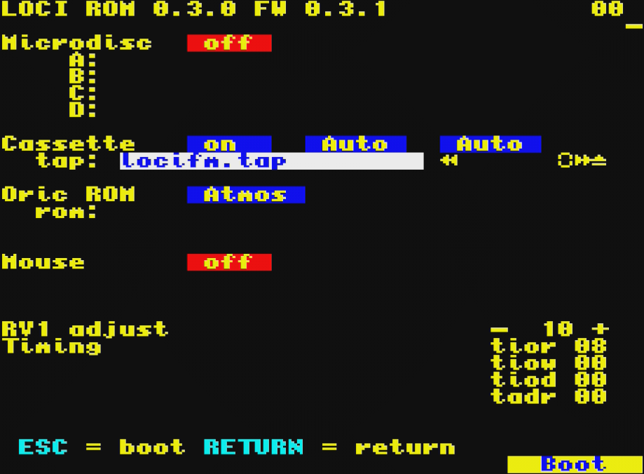
3. Go to the field to select tape images by pressing **T** (or navigate there
   with the cursor keys).
4. Press **SPACE** to go to the file browser.
5. Navigate to the location on the USB stick where you stored `locifm.tap`
   (or `locifm_fr.tap`).
6. Select it with **SPACE**.
7. Boot into the application by pressing **ESC**.
8. If the Auto load option of the LOCI is enabled, loading from tape starts
   automatically. If not, type `CLOAD""` and press **RETURN**.
9. The program should now load and start.

If no LOCI is detected, or the connected LOCI has a firmware version lower
than required (see [Requirements](#requirements)), the program shows an error
message and exits.

For details on how to operate your LOCI device, see the
[LOCI User Manual](https://github.com/sodiumlb/loci-hardware/wiki/LOCI-User-Manual).

---

## Keyboard commands

### In file browser pane:

|Key|Description
|---|---|
|**Cursor Up / Down**|Move down or up in the file browser pane
|**Cursor Left**|Go to parent directory
|**Cursor Right**|Go to main menu
|**RETURN**|Perform action selected for RETURN button: Select, mount or launch a file.
|**ESC**|Exit application and boot to mounted image(s)
|**.**|Go to next available LOCI drive for the active pane
|**,**|Go to previous available LOCI drive for the active pane
|**/**|Switch the active pane to the other pane
|**\\**|Go to the root directory of the drive in the active pane
|**D**|Page **d**own in the file browser pane
|**P**|Page u**p** in the file browser pane
|**T**|Go to **t**op: first entry in the file browser pane
|**B**|Go to **b**ottom: last entry in the file browser pane
|**S**|Toggle if file is **s**elected or not.
|**A**|Select **a**ll files in the active file browser pane
|**N**|Select **n**one of the files, so deselect all, in file browser pane
|**I**|**I**nverse selection in file browser pane
|**O**|Toggle if directories are alphabetically s**o**rted or not
|**F**|Select which **F**ilter to apply for showing directory entries or disable filtering.
|**C**|**C**opy present file or all selected files from directory in active pane to directory in non-active pane
|**V**|Mo**v**e present file or all selected files from directory in active pane to directory in non-active pane
|**DEL**|**Del**ete present file or directory (recursively for non-empty directories, after confirmation)
|**G**|Select tar**g**et disk drive for disk images to mount to.
|**R**|**R**ename present file or directory
|**M**|**M**ount present file to disk, tape or ROM.
|**U**|Select which drive, tape or ROM should be **u**nmounted.
|**W**|Start bro**w**sing inside a tape image from present .TAP file
|**E**|Create n**e**w directory
|**H**|Show **h**elp screen for keyboard commands
|**K**|Show properties (type, attributes, size) for the present file or directory
|**L**|Set or clear a wildcard fi**l**e name filter for both panes
|**J**|View the present text file in a full-screen, word-wrapped pager
|**Y**|Open the favourite directories popup

### In main menu and pulldown menus

|Key|Description
|---|---|
|**Cursor Up / Down**|Move down or up in the pulldown menu options
|**Cursor Left / Right**|Go to left or right in main menu.
|**RETURN**|Select option.
|**ESC**|Cancel (if allowed)

### Joystick direction mapping to keyboard commands

The left, right, down, up joystick directions are translated to the corresponding cursor keys and invoke the same commands.
The fire button invokes the same action as the RETURN key.

---

## Main application interface

After application start, the main application interface looks similar to:


Top line of the screen is a header showing application name, followed by the identification and firmware version string of the connected LOCI device.

Second line is the main menu bar. Go there by pressing the **Cursor Right** key or push right on your joystick.

Below are two panes, both representing a directory on a LOCI provided storage drive ID. The pane shown in yellow is the active pane, white the non-active.
First line of both panes is the name identification of the drive from which a directory is shown, second line shows the active path of the directory shown, of which the first number is the drive ID number. 0 is internal storage, 1 to 9 the USB mass storage devices connected to the LOCI.

Below are the directory entries, shown per page of 10. First the name, to the right the type:
- DSK: Disk image
- TAP: Tape image
- ROM: ROM image
- LCE: LOCI Executable (not yet implemented)
- DIR: Directory
- spaces: unknown type

In the active pane, in cyan the present entry is highlighted. This can be moved up and down by pressing cursor keys or joystick. Also page up/down is supported, just as go to top or bottom.
Based on the selected present files all commands are executed.
Reference is made to the [Keyboard commands](#keyboard-commands) section above for available keyboard commands, see [Command explanation](#command-explanation) for explanation of what all commands do and how they should be operated, sorted by the different main menu options.

---

## Command explanation

### App: Application options

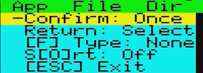

*Confirm*

Confirm is a toggle that decides if an 'are you sure' popup is shown, to confirm either a delete or a copy with overwrite action, once or on every individual file separately. Default is Once.

This function can be reached via the menu only.

*Return*

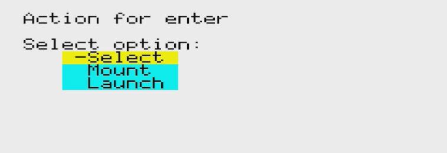

Selects which action should be performed when pressing RETURN:
- Select: Toggles if the file is selected or not on pressing **RETURN**, so **RETURN** will behave as the **S** key. Default option.
- Mount: File will be mounted on pressing **RETURN**, so **RETURN** will behave as the **M** key.
- Launch: File will be launched on pressing **RETURN**. This means that all other mounts will be unmounted, present file will be mounted, and application will be exited to boot to this mount. **RETURN** in this case will behave as pressing first the **U** key for every active mount, then the **ESC** key.

This function can be reached via the menu only.

*Type filter*

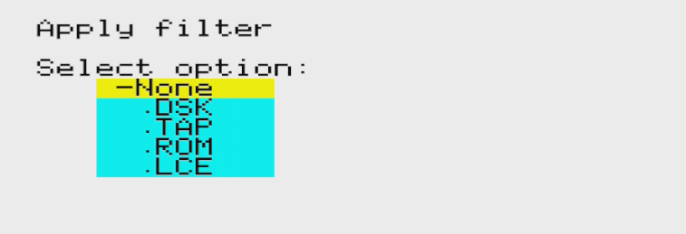

Selects which filter to apply when showing directories. The menu shows the
active value directly (`[F] Type: None`/`.DSK`/`.TAP`/`.ROM`/`.LCE`):
- None: No filter applied
- .DSK: Only .DSK disk images shown
- .TAP: Only .TAP tape images shown
- .ROM: Only .ROM rom images shown
- .LCE: Only LOCI Executables shown (not yet implemented as .LCE format is to be designed)

This function can be reached also by pressing the **F** key.

*Sort*

Toggle if sorting of directory entries is enabled or not.

**NB**: Sorting can be very slow on large directories, so beware of switching it on on those large directories. Also for this reason, default is Off.

This function can be reached also by pressing the **O** key.

*Exit*

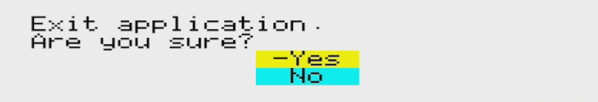

Application will exit and boot based on the active mounts (drive A > .TAP > ROM).

Autostarting from .TAP images is enabled.

This function can be reached also by pressing the **ESC** key.

### File: File operations

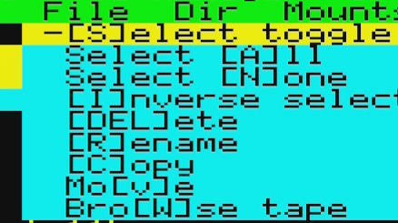

*Select toggle*

Toggles if presently highlighted file is selected or not. Selected files will be shown with a - before their name like in the screenshot below.

This function can be reached also by pressing the **S** key.

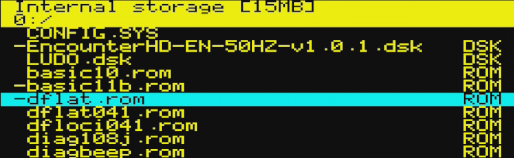

*Select all*

Selects all files in the present pane. This function can be reached also by pressing the **A** key.

*Select none*

Deselects all files in the present pane. This function can be reached also by pressing the **N** key.

*Inverse select*

Inverses the selection of files in the present pane. This function can be reached also by pressing the **I** key.

*Delete*

Deletes the present file or directory. Or, if a selection of files is made, all selected files.

A popup will ask for confirmation (based on the application configuration setting for Confirm in the App menu, only once, or for every file), after which deletion will proceed. Press key to return.

This function will also delete a directory:
- If the directory is empty, it is removed directly after the usual confirmation.
- If the directory is not empty, an extra "Directory not empty. Delete ALL contents?" confirmation is shown. Confirming recursively deletes the entire contents of the directory (files and subdirectories) and then the directory itself; declining leaves the directory untouched.
- Directories can not be selected, so deletion of directories has to be performed one by one.
- If the directory tree is deeper than 8 levels, the deepest level(s) may be left undeleted; a message will indicate this.

This function can be reached also by pressing the **DEL** key.

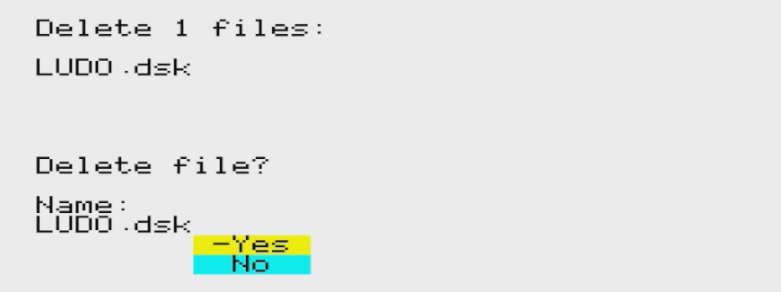

*Rename*

Renames the present file or directory.

A popup will appear to edit the name. Cursor keys and DEL key are supported in editing. Press RETURN to accept, ESC to cancel.

This function can be reached also by pressing the **R** key.

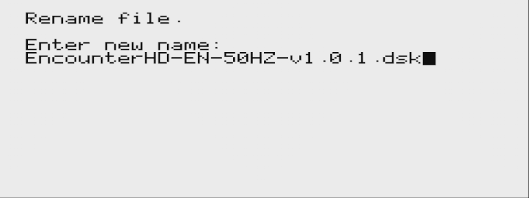

*Copy / Move*

Copies or moves the present file or directory. Or, if a selection of files and/or directories is made, all selected entries. Directories are copied or moved recursively, including all files and subdirectories they contain; if the target directory already exists its contents are merged.

Copy or move will be performed from the directory in the active pane to the directory in the non-active pane. You can not copy or move to the same directory, in this case an error message will be shown:

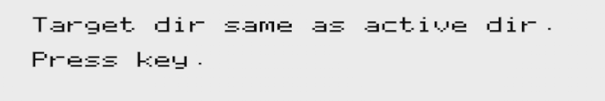

If file(s) with the same name already exist, a popup will ask for confirmation to overwrite the files in the target directory (based on the application configuration setting for Confirm in the App menu, only once, or for every file).

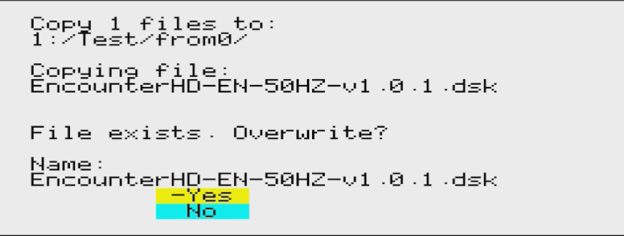

Otherwise a popup will appear showing copy or move progress. Pressing **ESC** cancels immediately, even in the middle of copying a file; any partially written destination file is removed automatically.

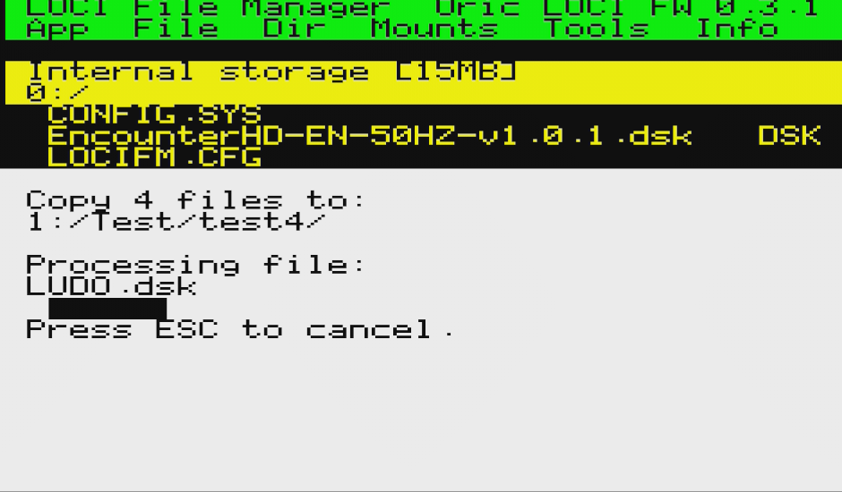

This function can be reached also by pressing the **C** key for copy or **V** key for move.

When copying or moving a directory tree deeper than 8 levels, the deepest level(s) may be left incomplete; a message will indicate this.

*Browse tape*

Enables browsing within a .TAP tape image. Obviously only works if the present highlighted directory entry is identified as type TAP.

Selecting first mounts the tape image. This popup is shown, press key to continue:

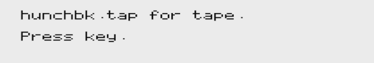

Then the active pane of the browser will look like this:

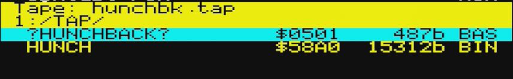

First line now shows Tape: to indicate you are inside a tape image, followed by the name of the tape image. Second line is still the active path to the tape image.

As directory entries now the files within the tape image are shown, starting with the name (if any), followed by the start address and size, finally the detected tape: BAS for a BASIC file, BIN for all others.

Inside a tape the copy, delete and rename functions do not operate (not possible, or not (yet) implemented). Therefore selecting files also does not work.

Only thing that does work in browsing tape is moving to the desired file inside a tape by pressing **RETURN**. This will give this popup:

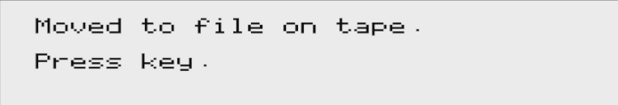

Go back to the normal directory by pressing **Cursor Left** (or joystick left).

This function can be reached also by pressing the **W** key.

### Dir: Directory navigation and operations

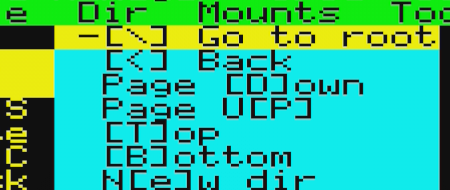

*Go to root*

Go to the root directory of the drive in the active pane. This function can be reached also by pressing the **\\** key.

*Back*

Go to the parent directory of the drive in the active pane. This function can be reached also by pressing the **Cursor Left** key.

*Page down*

Go to the next page of entries in the active pane. This function can be reached also by pressing the **D** key.

*Page up*

Go to the previous page of entries in the active pane. This function can be reached also by pressing the **P** key.

*Top*

Go to the first entry in the active pane. This function can be reached also by pressing the **T** key.

*Bottom*

Go to the last entry in the active pane. This function can be reached also by pressing the **B** key.

*New dir*

Create a new directory in the active pane from the active path.

This will give a popup to enter the dir name. Input the name (cursor keys and DEL key can be used for editing), press **RETURN** to accept and **ESC** to cancel.

This function can be reached also by pressing the **E** key.

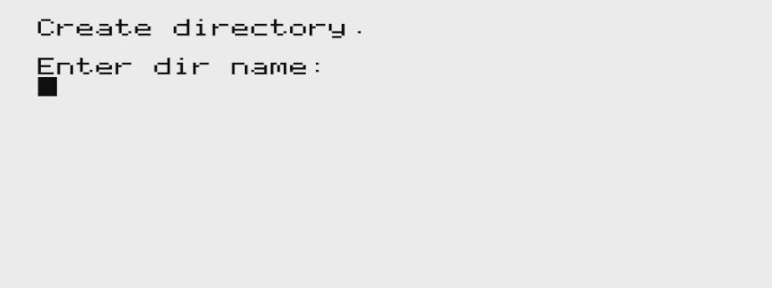

### Tools: Properties, name filter, text viewer, and favourites

*Properties*

Shows a popup with details about the present file or directory:
- Name, type and the active path. Type is shown as a description: "Directory" for directories, ".DSK - Disk image", ".TAP - Tape image", ".ROM - ROM image" or ".LCE - LOCI Executable" for those file types, and the file's own extension (e.g. ".TXT") for any other file
- Attributes: R (read-only) and S (system), shown as a dash (-) if not set
- Size in bytes. For a directory, the size is calculated recursively over all files in its tree; while calculating, "Calculating..." is shown, and pressing **ESC** cancels the calculation, after which "Cancelled." is shown instead of a size. If the directory tree is deeper than 8 levels, the total is shown with a trailing "+" to indicate it may be incomplete.

Press any key to close the popup.

This function can be reached also by pressing the **K** key.

*Text filter*

Opens a popup to enter a wildcard pattern (using `*` and `?`, case-insensitive) that filters the directory listing in both panes by file name. Directories are always shown regardless of the pattern, so navigation is never blocked.

Enter an empty pattern to clear the filter. Press **RETURN** to apply, **ESC** to cancel without changes. This filter is not remembered across restarts.

The Tools menu shows `[L] Text: On` or `[L] Text: Off` depending on whether a pattern is currently active; the pattern itself is shown in this popup's "Current:" line.

This function can be reached also by pressing the **L** key.

*View text*

Opens the present file in a full-screen, word-wrapped text viewer. Press **SPACE** (or any other key) to advance to the next page, or **ESC** to exit back to the file browser. Paging is forward-only.

Any byte that is not printable ASCII (0x20-0x7E) -- e.g. when viewing a non-text/binary file -- is shown as a `.` placeholder, so binary content displays safely instead of corrupting the screen or truncating the line.

Press **X** at any pause point to switch to a hex dump of the same file, showing each byte's offset and hex value plus an ASCII column; press **X** again to switch back to the word-wrapped text view. Either way, the file is read from the beginning again in the new view.

This function can be reached also by pressing the **J** key.

*Favourites*

Opens a popup listing 8 bookmark slots, shared by both panes and saved to `0:/idi8b/locifm/locifm.cfg`. Empty slots are shown as "(empty)".

- Press **1**-**8** to jump the active pane to the directory bookmarked in that slot (no effect if the slot is empty).
- Press **A** then **1**-**8** to bookmark the active pane's current directory into that slot, overwriting any previous entry.
- Press **D** then **1**-**8** to clear that slot.
- Press **ESC** to close the popup.

This function can be reached also by pressing the **Y** key.

### Info: Version information and help

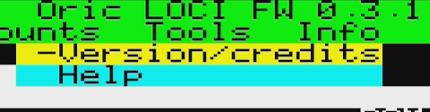

*Version/credits*

Shows two full-screen splashes. The first displays the "I Dream in 8 Bits"
logo together with the application name, version (`vMAJOR.MINOR.PATCH -
YYYYMMDD-HHMMSS` build timestamp) and credits; the second shows a QR code
linking to the project's GitHub page. Press any key to advance to the next
screen, and again to return to the application.

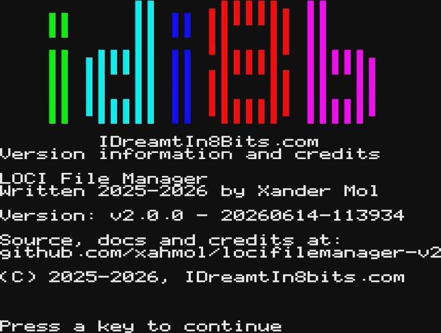

*Help*

Shows a help screen for the keyboard commands.

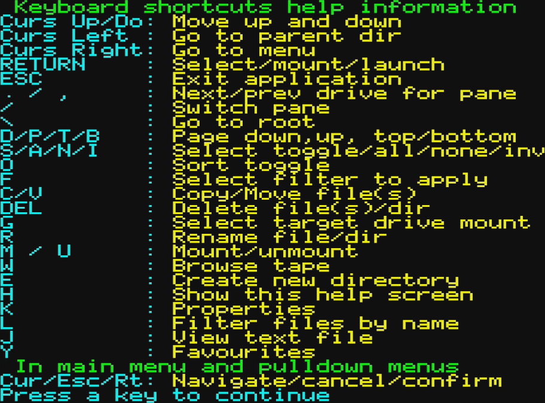

---

## Version history and download

| Version | Date | Notes |
|---|---|---|
| 2.0.0 | 2026 | Oscar64 rebuild — in development |

### Changes from v1 to v2

v2 is a ground-up rewrite (Oscar64, bare-metal) of the v1 (CC65)
implementation. For users coming from v1, the main differences are:

- Directories (not just files) can now be copied and moved, including all
  their contents
- Deleting a non-empty directory now offers to recursively delete its entire
  contents, instead of refusing
- A copy or move can be cancelled mid-transfer with **ESC**; any partial
  destination file is removed automatically
- A new wildcard filename filter (**L**) complements the existing type filter
- A new full-screen, word-wrapped text file viewer (**J**)
- A new properties popup (**K**) showing type, attributes and size,
  including a recursively calculated total size for directories
- Available in English and French
- New splash screens showing version info and a GitHub QR code

### Previous versions (v1, CC65)

The CC65-based v1 implementation remains available at
[locifilemanager](https://github.com/xahmol/locifilemanager):

- https://github.com/xahmol/locifilemanager/raw/refs/heads/main/BUILD/locifm.tap

| Version | Notes |
|---|---|
| 0.1.2 | Add move function |
| 0.1.1 | Bugfixes on tape browse and boot preference |
| 0.1.0 | First feature complete beta release |

---

## Credits

LOCI File Manager v2
File manager for the LOCI mass storage device for Oric Atmos
Written in 2025-2026 by Xander Mol

https://github.com/xahmol/locifilemanager-v2

https://www.idreamtin8bits.com/

For information and documentation on the LOCI mass storage device:
-   LOCI User Manual

    https://github.com/sodiumlb/loci-hardware/wiki/LOCI-User-Manual
-   Sellers of my assembled LOCI device:
    - Raxiss: https://www.raxiss.com/article/id/38-LOCI

Code and resources from others used:
-   LOCI ROM by Sodiumlightbaby, 2024

    https://github.com/sodiumlb/loci-rom

-   Oscar64 cross compiler by drmortalwombat:

    https://github.com/drmortalwombat/oscar64

-   v1 (CC65) LOCI File Manager, the functional reference for v2:

    https://github.com/xahmol/locifilemanager

-   CC65 cross compiler, used by v1:

    https://cc65.github.io/

-   DraBrowse source code for inspiration and text input routine
    DraBrowse (db*) is a simple file browser.
    Originally created 2009 by Sascha Bader.
    Used version adapted by Dirk Jagdmann (doj)

    https://github.com/doj/dracopy

-   lib-ijk-egoist from oricOpenLibrary (for joystick support via Raxiss IJK interface)
    By Raxiss, (c) 2021

    https://github.com/iss000/oricOpenLibrary/tree/main/lib-ijk-egoist

-   forum.defence-force.org: For inspiration and advice while coding.

-   Original windowing system code on Commodore 128 by unknown author.

-   Phosphoric, a cycle-accurate ORIC-1/Atmos emulator by Xander Mol, used to
    drive the automated headless test suite (`make test`)

    https://github.com/xahmol/Phosphoric

-   Tested using real hardware Oric Atmos plus LOCI

The code can be used freely as long as you retain
a notice describing original source and author.

THE PROGRAMS ARE DISTRIBUTED IN THE HOPE THAT THEY WILL BE USEFUL,
BUT WITHOUT ANY WARRANTY. USE THEM AT YOUR OWN RISK!

---

## License

Copyright (C) 2025-2026 Xander Mol.

This program is free software: you can redistribute it and/or modify it under
the terms of the GNU General Public License as published by the Free Software
Foundation, version 3.

See the [LICENSE](LICENSE) file for the full licence text.
